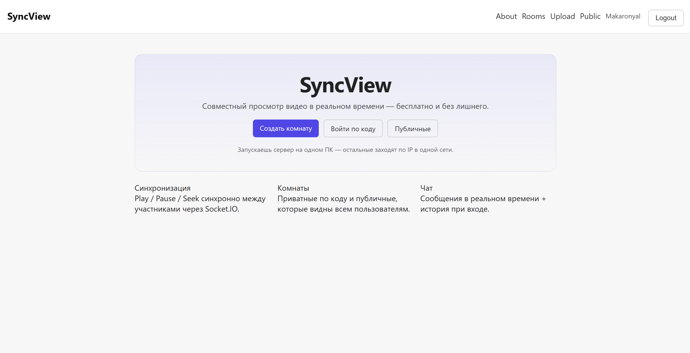
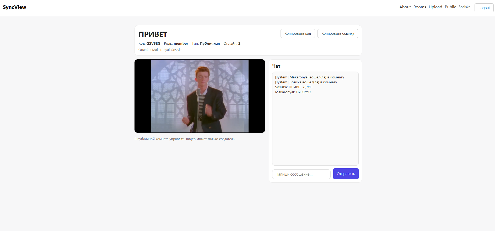
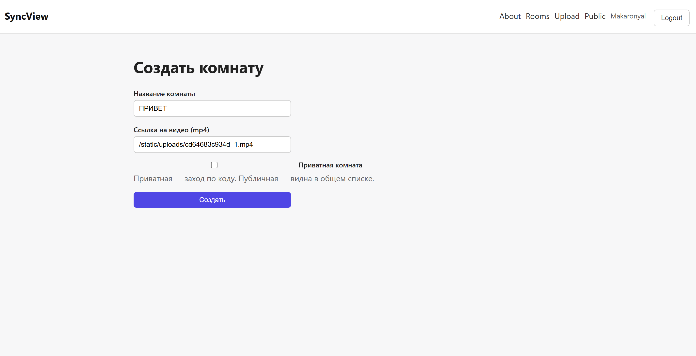

# SyncView - Совместный просмотр видео в реальном времени

SyncView - это мощный локальный сервис для синхронного просмотра видео с друзьями. Один запускает сервер у себя на ПК, остальные подключаются по IP в одной сети. Полная синхронизация плеера, чат, комнаты, загрузка видео и многое другое.


---

## Ключевые возможности

### Комнаты
- Создание публичных и приватных комнат
- Уникальный код комнаты (например AB12CD) для быстрого входа
- Список публичных комнат
- Удаление комнаты только создателем (host)

### Синхронный просмотр
- Встроенный HTML5-плеер
- Полная синхронизация между всеми участниками:
  - Play / Pause
  - Перемотка (seek)
  - Автоматическая подгонка времени
- Только host может управлять видео в публичных комнатах

### Чат в реальном времени
- Мгновенные сообщения через Socket.IO
- История чата при входе
- Системные уведомления (кто зашёл / вышел)

### Онлайн и присутствие
- Счётчик пользователей в комнате
- Список кто сейчас онлайн
- Автоматическое обновление

### Загрузка видео
- Загружай свои mp4-файлы прямо на сервер
- Видео сохраняется в app/static/uploads/
- Доступно по ссылке /static/uploads/...

### Безопасность
- Flask-Login + CSRF защита
- Приватные комнаты по коду
- Только создатель комнаты может её удалить

---

## Технологический стек

| Компонент       | Технология                  |
|-----------------|-----------------------------|
| Backend         | Flask 3.0 + Flask-SocketIO  |
| База данных     | SQLite + SQLAlchemy         |
| Аутентификация  | Flask-Login + Flask-WTF     |
| Реал-тайм       | Socket.IO (WebSocket)       |
| Frontend        | HTML5 + Vanilla JS + Socket.IO client |
| Статические файлы | Bootstrap + Socket.IO       |

---

## Быстрый старт

### 1. Установка

```bash
# Распакуй архив SyncView.zip

cd SyncView

# Создай виртуальное окружение
python -m venv .venv

# Активируй его
# Windows:
.venv\Scripts\activate
# Linux/macOS:
source .venv/bin/activate

# Установи зависимости
pip install -r requirements.txt
```

### 2. Запуск сервера

```bash
python run.py
```

Сервер запустится на http://0.0.0.0:8000

Открой в браузере: http://127.0.0.1:8000 (или IP твоего ПК в локальной сети)

### 3. Как подключиться друзьям

- Запусти сервер у себя
- Скажи друзьям IP-адрес твоего ПК в локальной сети (например 192.168.1.45:8000)
- Они открывают этот адрес в браузере и присоединяются к комнате

---

## Структура проекта

```
SyncView/
├── app/
│   ├── __init__.py
│   ├── config.py
│   ├── extensions.py
│   ├── forms/
│   ├── models/          # User, Room, Message, Membership
│   ├── routes/          # auth, rooms, uploads, pages
│   ├── sockets/         # room_events.py - вся магия синхронизации
│   ├── static/
│   └── templates/
├── run.py               # точка входа
├── run.bat              # удобный запуск для Windows
├── requirements.txt
└── README.md
```

---

## Скриншоты интерфейса

### Главная страница


### Страница комнаты с плеером


### Чат и список участников


### Создание комнаты


---

## Полезные команды

**Полный сброс проекта** (очистка базы + загрузок):

```bash
# Windows
run_reset.bat

# или вручную
rm -rf instance/ app/static/uploads/*
```

---

## Планы на будущее

- [ ] Поддержка YouTube / Vimeo ссылок
- [ ] Тёмная тема
- [ ] История просмотренных видео
- [ ] Голосовой чат / реакция
- [ ] Возможность запуска через Docker
- [ ] Мобильная версия

---

## Лицензия

MIT License - делай что хочешь.

---

Сделано с любовью к совместному просмотру кино и сериалов

Если проект зашёл - поставь звезду и расскажи друзьям!

---

*README создан специально под этот проект*